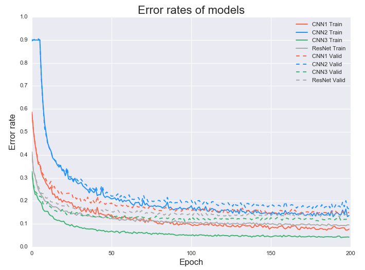

## Tensorflow CNN

### Introduction

  An experiment using an AlexNet like Converlution Neural Network(CNN) for Cifar10 classify task. Three different models are trained for comparison:
  
1. Model1 : AlexNet like structure without dropout layers.
2. Model2 : AlexNet with 0.5 dropout rate.
3. Model3 : AlexNet combined with batch normalization layers.

### Model Structure

| Models              | CNN1        | CNN2        | CNN3        |
|---------------------|-------------|-------------|-------------|
| Random Crop         | √           | √           | √           |
| Random Flip         | √           | √           | √           |
| Kernel Size         | 3×3         | 3×3         | 3×3         |
| Kernel Stride       | 1           | 1           | 1           |
| Pooling             | Max pooling | Max pooling | Max pooling |
| Pooling Stride      | 2           | 2           | 2           |
| Conv layers         | 3           | 3           | 3           |
| Dropout             | ×           | 0.5         | ×           |
| Batch Normalization | ×           | ×           | √           |
  
### Performance

  

### References:

* [1]. Alex Krizhevsky, Ilya Sutskever, Geoffrey E. Hinton. "ImageNet Classification with Deep Convolutional Neural Networks."
* [2]. Ioffe, Sergey, and Christian Szegedy. "Batch normalization: Accelerating deep network training by reducing internal covariate shift."
* [3]. Karen Simonyan, Andrew Zisserman. "Very Deep Convolutional Networks for Large-Scale Image Recognition."
* [4]. He, Kaiming, et al. "Deep Residual Learning for Image Recognition."

### Dependencies

* [Numpy](http://www.numpy.org/)
* [Tensorflow](https://www.tensorflow.org/)
